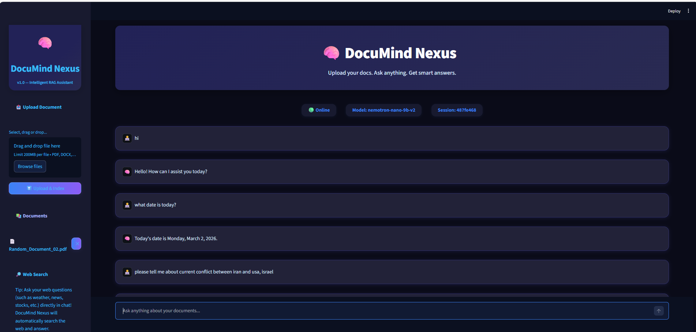
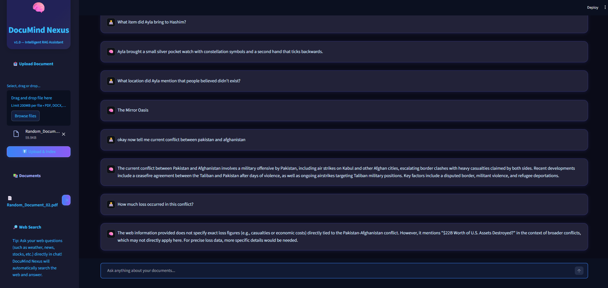

<div align="center">

# 🧠 DocuMind Nexus

### *Your Intelligent Docs-First RAG Assistant*

[](https://python.org)
[](https://fastapi.tiangolo.com)
[](https://streamlit.io)
[](https://langchain.com)
[](https://www.trychroma.com)
[](LICENSE)

<br/>

**Upload PDF, DOCX & HTML documents → Index into a vector database → Chat with your docs using AI**

*With optional live web search fallback via SerpAPI and a fully offline demo mode.*

<br/>

[🚀 Quick Start](#-quick-start) · [✨ Features](#-features) · [🏗️ Architecture](#%EF%B8%8F-architecture) · [📖 API Reference](#-api-reference) · [🤝 Contributing](#-contributing)

</div>

---

## 📸 Screenshots

<div align="center">
<table>
  <tr>
    <td></td>
    <td></td>
  </tr>
  <tr>
    <td align="center"><b>💬 Chat Interface</b></td>
    <td align="center"><b>📄 Document Management</b></td>
  </tr>
</table>
</div>

---

## ✨ Features

| Feature | Description |
|---------|-------------|
| 📤 **Multi-Format Upload** | Upload and index **PDF**, **DOCX**, and **HTML** documents seamlessly |
| 🔍 **Docs-First RAG** | Always searches your indexed documents before falling back to other sources |
| 🧬 **Vector Embeddings** | Documents chunked and embedded into **ChromaDB** for semantic retrieval |
| 🌐 **Live Web Search** | Optional **SerpAPI** fallback for real-time queries (weather, news, current events) |
| 💾 **Session Memory** | Chat history persisted in **SQLite** — pick up right where you left off |
| 🤖 **Multi-Model Support** | Choose from **4 free LLMs** via OpenRouter (Nemotron, Qwen3, DeepSeek R1, Mistral) |
| 🔌 **Offline Demo Mode** | Built-in `SimpleHashEmbeddings` — no downloads, no API calls, fully offline |
| 🗑️ **Document Management** | Upload, list, and delete documents with full Chroma + DB cleanup |
| 🎨 **Modern Dark UI** | Beautiful, responsive Streamlit interface with gradient accents |

---

## 🏗️ Architecture

```
┌─────────────────────────────────────────────────────────────────┐
│                        🖥️  FRONTEND                            │
│                     (Streamlit — Port 8501)                     │
│                                                                 │
│  ┌──────────────┐  ┌──────────────────┐  ┌───────────────────┐ │
│  │ streamlit_   │  │  chat_interface  │  │    sidebar.py     │ │
│  │   app.py     │  │      .py         │  │  (Upload/Docs/    │ │
│  │ (Layout/CSS) │  │  (Chat View)     │  │   Model Select)   │ │
│  └──────┬───────┘  └────────┬─────────┘  └────────┬──────────┘ │
│         └──────────────┬────┘                      │            │
│                   ┌────▼────────────────────────────▼──┐        │
│                   │         api_utils.py                │        │
│                   │    (HTTP Client → Backend)          │        │
│                   └──────────────┬─────────────────────┘        │
└──────────────────────────────────┼──────────────────────────────┘
                                   │  REST API
                                   ▼
┌─────────────────────────────────────────────────────────────────┐
│                        ⚙️  BACKEND                              │
│                     (FastAPI — Port 8000)                       │
│                                                                 │
│  ┌──────────────┐  ┌──────────────────┐  ┌───────────────────┐ │
│  │   main.py    │  │ langchain_utils  │  │  pydantic_models  │ │
│  │  (API Routes)│  │     .py          │  │      .py          │ │
│  │  /chat       │  │  (RAG Chain +    │  │  (Request/Response │ │
│  │  /upload-doc │  │   Web Fallback)  │  │   Schemas)        │ │
│  │  /list-docs  │  └────────┬─────────┘  └───────────────────┘ │
│  │  /delete-doc │           │                                   │
│  └──────┬───────┘  ┌────────▼─────────┐  ┌───────────────────┐ │
│         │          │  chroma_utils.py  │  │   db_utils.py     │ │
│         │          │  (Loaders/Chunks/ │  │  (SQLite: Logs +  │ │
│         │          │   Embeddings)     │  │   Doc Records)    │ │
│         │          └────────┬─────────┘  └────────┬──────────┘ │
└─────────┼───────────────────┼─────────────────────┼────────────┘
          │                   │                     │
          ▼                   ▼                     ▼
   ┌────────────┐    ┌──────────────┐      ┌──────────────┐
   │  SerpAPI   │    │  ChromaDB    │      │   SQLite     │
   │ (Optional) │    │ ./chroma_db  │      │ rag_app.db   │
   └────────────┘    └──────────────┘      └──────────────┘
```

---

## 📂 Project Structure

```
DocuMind-Nexus/
│
├── 📁 backend/                    # FastAPI server
│   ├── main.py                    # API endpoints & server entry point
│   ├── langchain_utils.py         # RAG chain logic + web search fallback
│   ├── chroma_utils.py            # Document loaders, chunking & Chroma ops
│   ├── db_utils.py                # SQLite database operations
│   └── pydantic_models.py         # Request/response schemas & enums
│
├── 📁 frontend/                   # Streamlit client
│   ├── streamlit_app.py           # Main app layout, styling & session init
│   ├── chat_interface.py          # Chat message display & input handling
│   ├── sidebar.py                 # Upload, document list & model selector
│   └── api_utils.py               # HTTP client for backend communication
│
├── 📁 images/                     # Screenshots for README
│   ├── image_1.png
│   └── image_2.png
│
├── .env.example                   # Environment variable template
├── requirements.txt               # Python dependencies
└── README.md                      # You are here! 📍
```

---

## 🚀 Quick Start

### Prerequisites

- **Python 3.10+** (recommended)
- An **[OpenRouter](https://openrouter.ai/)** API key (free tier available)
- *(Optional)* A **[SerpAPI](https://serpapi.com/)** key for live web search

### 1️⃣ Clone the Repository

```bash
git clone https://github.com/AbdulRehman393/DocuMind-Nexus.git
cd DocuMind-Nexus
```

### 2️⃣ Create a Virtual Environment

```bash
python -m venv venv

# Windows
venv\Scripts\activate

# macOS / Linux
source venv/bin/activate
```

### 3️⃣ Install Dependencies

```bash
pip install -r requirements.txt
```

### 4️⃣ Configure Environment Variables

Create a `.env` file in the **root** directory (same level as `backend/` and `frontend/`):

```bash
cp .env.example .env
```

Edit `.env` with your keys:

```env
OPENROUTER_API_KEY=your_openrouter_api_key_here
SERPAPI_API_KEY=your_serpapi_key_here          # Optional
```

### 5️⃣ Start the Backend

```bash
cd backend
python main.py
```

> ✅ Backend running at **http://127.0.0.1:8000**

### 6️⃣ Start the Frontend (new terminal)

```bash
cd frontend
streamlit run streamlit_app.py
```

> ✅ Frontend running at **http://localhost:8501**

---

## 📖 API Reference

| Method | Endpoint | Description |
|--------|----------|-------------|
| `POST` | `/chat` | Send a question and get an AI-powered answer |
| `POST` | `/upload-doc` | Upload and index a document (PDF/DOCX/HTML) |
| `GET` | `/list-docs` | List all indexed documents |
| `POST` | `/delete-doc` | Delete a document from Chroma & database |

### Example: Chat Request

```bash
curl -X POST http://127.0.0.1:8000/chat \
  -H "Content-Type: application/json" \
  -d '{
    "question": "What is this document about?",
    "model": "nvidia/nemotron-nano-9b-v2:free",
    "session_id": "my-session-123"
  }'
```

### Example: Upload Document

```bash
curl -X POST http://127.0.0.1:8000/upload-doc \
  -F "file=@/path/to/document.pdf"
```

---

## 🤖 Supported Models

All models are **free** via [OpenRouter](https://openrouter.ai/):

| Model | ID | Best For |
|-------|----|----------|
| **NVIDIA Nemotron Nano 9B** | `nvidia/nemotron-nano-9b-v2:free` | General purpose (default) |
| **Qwen3 4B** | `qwen/qwen3-4b:free` | Fast, lightweight responses |
| **DeepSeek R1** | `deepseek/deepseek-r1-0528:free` | Reasoning & analysis |
| **Mistral Small 3.1 24B** | `mistralai/mistral-small-3.1-24b-instruct:free` | Detailed, instruction-following |

---

## ⚙️ How It Works

```
User asks a question
        │
        ▼
   ┌─────────┐     YES
   │Greeting?├──────────► Return friendly greeting
   └────┬────┘
        │ NO
        ▼
   ┌──────────┐    FOUND
   │ Search   ├──────────► LLM answers from document context
   │ Documents│
   └────┬─────┘
        │ NOT FOUND
        ▼
   ┌──────────┐    MATCH
   │ Live     ├──────────► SerpAPI search → LLM summarizes results
   │ Keywords?│
   └────┬─────┘
        │ NO MATCH
        ▼
   ┌──────────┐
   │ General  ├──────────► LLM answers conversationally
   │ Fallback │
   └──────────┘
```

**Priority Order:** Greeting → Document RAG → Web Search → General LLM

---

## 🛠️ Tech Stack

<div align="center">

| Layer | Technology | Purpose |
|-------|-----------|---------|
| **Frontend** | Streamlit | Interactive chat UI with dark theme |
| **Backend** | FastAPI + Uvicorn | High-performance async API server |
| **LLM Gateway** | OpenRouter | Access to multiple free LLM models |
| **Orchestration** | LangChain | RAG chain, tools & document processing |
| **Vector Store** | ChromaDB | Local vector database for embeddings |
| **Database** | SQLite | Chat logs & document record storage |
| **Web Search** | SerpAPI | Real-time web search fallback |
| **Embeddings** | SimpleHashEmbeddings | Offline hash-based embeddings (demo) |

</div>

---

## 🤝 Contributing

Contributions are welcome! Here's how to get started:

1. **Fork** the repository
2. **Create** a feature branch: `git checkout -b feature/amazing-feature`
3. **Commit** your changes: `git commit -m 'Add amazing feature'`
4. **Push** to the branch: `git push origin feature/amazing-feature`
5. **Open** a Pull Request

---

## 📄 License

This project is open source and available under the [MIT License](LICENSE).

---

## 👤 Author

<div align="center">

### **Abdul Rehman Saeed**

[](https://github.com/AbdulRehman393)
[](https://linkedin.com/in/khawaja-abdul-rehman-24088b266)
[](mailto:khawajaabdulrehman393@gmail.com)

</div>

---

<div align="center">

### ⭐ If you found this project helpful, please give it a star!

<br/>

Made with ❤️ by [Abdul Rehman Saeed](https://github.com/AbdulRehman393)

</div>
